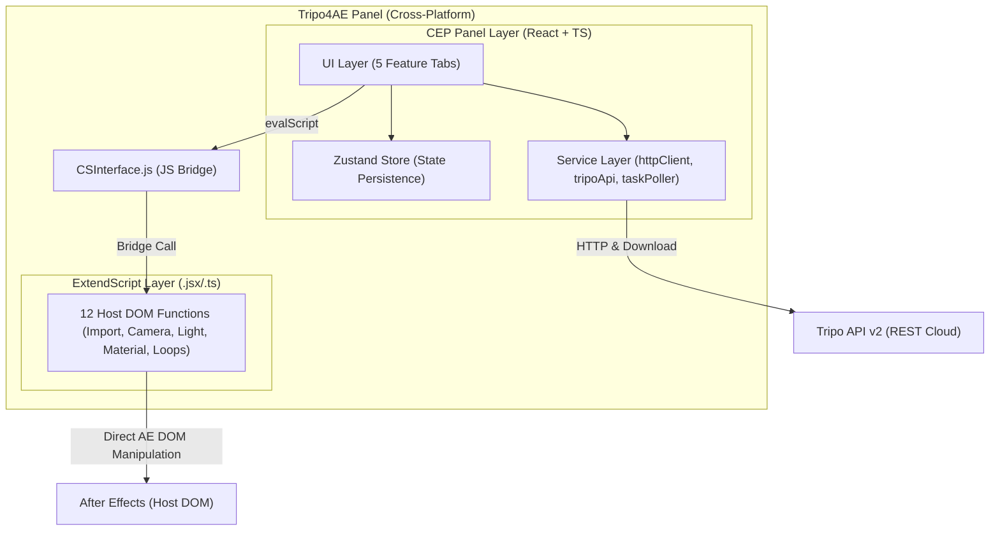

<h1 align="center">Tripo4AE</h1>

<p align="center">
  <strong>Complete AI 3D Generation Workflow directly in Adobe After Effects</strong>
</p>

<p align="center">
  English | <a href="./README_zh.md">中文</a>
</p>

<p align="center">
  
  
  
  
  
</p>

---

## What is this?

Tripo4AE is an Adobe After Effects CEP extension panel that integrates [Tripo AI](https://platform.tripo3d.ai/)'s complete 3D generation pipeline directly into your AE timeline.

**In short: Input text prompts or reference images, and get 3D models with PBR materials and rigging/animations directly on the After Effects timeline.**

- Integrates **21** Tripo API endpoints.
- **5** feature tabs covering the complete 3D pipeline.
- **12** ExtendScript host functions driving the AE 3D scene DOM.
- Deep integration with **AE 2026 Advanced 3D** (Mercury 3D Engine).
- Panel state persistence across reloads with task auto-resume.

---

## Features

### 🎨 Generation (Generate)

| Input Mode | Description |
|------------|-------------|
| Text → 3D | Input prompts in English/Chinese, select style presets (cartoon, venom, clay, steampunk, barbie, gold, ancient bronze, etc.) |
| Image → 3D | Drag-and-drop to upload any reference image to generate the 3D model |
| Multiview → 3D | Upload front, left, back, and right view images for high-precision reconstruction |

Parameters: Model Version (v3.1, P1, Turbo, v3.0, v2.5), Face Limit, PBR, Quad, Geometry Quality, Seeds.

### ✨ Refine & Texture

- **Refining**: Upgrade a low-poly draft model into a high-quality asset.
- **Re-texturing**: Generate new textures via text prompts, reference images, or style reference photos.
- **PBR Upgrade**: Three levels of texture quality: standard, detailed, and extreme.
- **Part-based Texturing**: Individually texture specific parts based on mesh segmentation.
- **Baking**: Bake advanced procedural/complex shaders down into base textures.

### 🎬 Animation

**Tripo Services:**

| Function | Description |
|----------|-------------|
| PreRigCheck | Check model riggability and return recommended rig types |
| Rig | Auto-rig meshes (Biped, Quadruped, Hexapod, Octopod, Avian, Serpentine, Aquatic) |
| Retarget | Apply 100+ animation presets (walk, run, combat, dance, daily, sports, etc.) |

**AE Local Services:**

| Category | Presets / Features |
|----------|---------|
| Camera | Orbit, Push, Track, Jib (with automatic 3D Null controller rig parenting) |
| Model Entrance | Fade In, Scale Pop, Flip, Slide In |
| Loop Expressions | Spin (X/Y/Z), Float, Breathe |
| Easing | Linear, Ease In/Out, Bounce, Elastic |
| Model Alignment | Align Model to Ground, Align Ground to Model (using sourceRectAtTime) |
| PBR Materials | Advanced PBR Material Options panel to read and apply 10 core PBR parameters |

### 🔧 Transformation (Transform)

| Function | Description |
|----------|-------------|
| Stylize | Lego, Voxel, Voronoi, Minecraft (adjustable block size), Keyring, Fridge Magnet, Keycap |
| Segmentation | Automatically segment mesh into named components |
| Mesh Completion | Reconstruct and complete missing mesh areas |
| Mesh Simplification | Decimate faces, optional quad mesh output, High-Poly to Low-Poly normal baking |
| Conversion | Export to FBX, OBJ, GLTF, USDZ, STL, 3MF (with target presets: Blender / 3ds Max / Mixamo) |

### 📚 Model Library (Library)

- Track all generated models with metadata and thumbnails.
- **Cloud Generation History**: Pull and list past generation history directly from Tripo Cloud to prevent credit loss and download previously generated assets.
- One-click re-import to active composition (uses cached local file).
- Save/load custom animation templates as JSON.
- Import external models (GLB, GLTF, FBX, OBJ, ZIP) to run through the Tripo pipeline.

---

## AE 2026 Advanced 3D Deep Integration

| Feature | Description |
|---------|-------------|
| ThreeDModelLayer Detection | Accurately identify native 3D model layers (AE 24.4+) at the script level |
| Adobe Standard Material | Control 12 PBR properties via match names; UI panel allows reading/writing 10 core parameters. *Note: native PBR sliders do not visually affect baked materials on imported GLB models.* |
| Embedded Animation | Control embedded GLB/FBX skeletal animations via Time Remap expressions |
| HDRI Environment Light | One-click environment light creation with custom HDRI setups, background visibility toggle, and shadow-casting enabled for realistic Ambient Occlusion (AO) and contact shadows |
| Camera Null Control Rig | Automatically parents cameras to a 3D Null controller (`Tripo4AE_CameraCtrl`) to enable intuitive orbit and rotation control |
| Ground Shadow Catcher | Creates a visible light-gray ground (`[0.85, 0.85, 0.85]`) configured to accept shadows while preventing self-shadow artifacts |
| Auto-Align Tools | Script-driven bounding box calculation to align models perfectly with the composition floor or vice-versa |
| Material Presets | 8 built-in presets: default, metallic, glass, plastic, rubber, ceramic, gold, clay |
| Renderer Switch | Automatically switches composition renderer to Advanced 3D / Mercury 3D Engine |

---

## Pipeline & Reliability

```
Text/Image → Generate → Refine → Texture → Rig → Animate → Convert → Import AE
   ✅         ✅       ✅      ✅      ✅       ✅       ✅        ✅
```

- **Pipeline Stepper**: Visual step-by-step pipeline tracker across tabs; allows skipping steps or reusing caches.
- **State Persistence**: Zustand + localStorage ensures panel state survives docking/undocking and reloads.
- **Auto-resume**: Scans persisted state on startup to resume unfinished generation tasks automatically.
- **Adaptive Polling**: Automatically adjusts poll interval based on API-returned `running_left_time`, capped at 5s.
- **Robust Downloader**: Built-in Node.js HTTP/HTTPS downloader running outside the Chromium page sandbox to bypass CORS restrictions and SSL negotiation hangs under Adobe CEP.

---

## System Architecture



**Core Principle**: All heavy operations (network, polling, file downloading) are handled asynchronously in the CEP/React/Node layer. ExtendScript only performs lightweight, instantaneous AE DOM operations to prevent UI freezes.

---

## Tech Stack

| Layer | Technology | Version |
|---|---|---|
| CEP Panel | React + TypeScript + Vite | React 19, TS 5.x, Vite 6 |
| State | Zustand | 5.x (with localStorage persist middleware) |
| ExtendScript | Babel + Rollup compiled to ES3 | `types-for-adobe` typings |
| Build | Bolt CEP (`vite-cep-plugin`) | 2.x |
| Bridge | CSInterface.js | CEP 12 |
| API | Tripo OpenAPI v2 | REST API |

---

## Getting Started

### Prerequisites

| Dependency | Minimum Version |
|------------|-----------------|
| After Effects | 2024 (2026 Recommended) |
| Node.js | 18+ |
| npm | 9+ |
| OS | Windows 10/11 / macOS (Intel or Apple Silicon) |

> **Get API Key**: Register at [platform.tripo3d.ai](https://platform.tripo3d.ai/) to obtain your API key.

### Installation

```bash
git clone <repo-url> tripo4ae
cd tripo4ae
npm install
```

### Build & Run

```bash
# 1. Enable unsigned CEP panel loading
#    Select CSXS version according to your AE version:
#    AE 2024 / 2025 → CSXS.11
#    AE 2026        → CSXS.12
#
#    On macOS:
defaults write com.adobe.CSXS.12 PlayerDebugMode 1
#
#    On Windows (Run Command Prompt as Administrator):
reg add "HKCU\Software\Adobe\CSXS.12" /v PlayerDebugMode /t REG_SZ /d 1 /f

# 2. Build and symlink to Adobe Extension Directory
npm run build
npm run symlink

# 3. Start After Effects
#    Open Panel: Window → Extensions → Tripo4AE
```

### Development (Hot-Reload)

```bash
npm run dev
# Panel loads from Vite dev server at localhost:3000
# Edits in src/client/ auto-refresh. Edits in src/jsx/ auto-recompile.
```

### Production Package

```bash
npm run build    # Build to dist/cep/
npm run zxp      # Package into .zxp installer
```

### Testing

```bash
npx jest --runInBand
# 6 Test Suites / 73 Test Cases
```

---

## Project Structure

```
tripo4ae/
├── src/
│   ├── client/                        # CEP Panel (React)
│   │   ├── App.tsx                    # Root Component (Tabs navigation, Header, Pipeline)
│   │   ├── components/
│   │   │   ├── GenerateTab/           # Generation tab
│   │   │   ├── RefineTextureTab/      # Refinement and texturing tab
│   │   │   ├── AnimationTab/          # Animation tab (Local AE + Tripo Rig + PBR Sliders)
│   │   │   ├── TransformTab/          # Transformation and mesh editing tab
│   │   │   ├── LibraryTab/            # Local model library and templates
│   │   │   ├── PipelineStepper/       # Visual progress stepper
│   │   │   └── common/                # Shared UI controls
│   │   ├── hooks/
│   │   │   └── useCsInterface.ts      # CSInterface Bridge hook
│   │   ├── services/
│   │   │   ├── httpClient.ts          # Axios wrapper with retry and exponential backoff
│   │   │   ├── tripoApi.ts            # Tripo API client (upload, download, convert)
│   │   │   └── taskPoller.ts          # Adaptive status poller
│   │   └── stores/
│   │       └── useStore.ts            # Zustand global state with persistence
│   │
│   ├── jsx/                           # ExtendScript entry bundle
│   │   ├── index.ts                   # Entry registering namespace and host alias
│   │   └── aeft/
│   │       └── aeft.ts                # 12 AE host DOM methods (ES3 target)
│   │
│   └── shared/
│       ├── types.ts                   # TypeScript interfaces (~300 lines)
│       └── constants.ts               # API versions, style list, constants
│
├── __tests__/                         # Jest Tests (6 suites, 73 cases)
│   ├── aeft.test.ts                   # ExtendScript mock tests
│   ├── hooks/
│   │   └── useCsInterface.test.ts     # CSInterface hooks
│   ├── services/
│   │   ├── httpClient.test.ts
│   │   ├── taskPoller.test.ts
│   │   └── tripoApi.test.ts
│   └── stores/
│       └── useStore.test.ts
│
├── CSXS/
│   └── manifest.xml                   # CEP Panel configuration manifest
├── cep.config.ts                      # Bolt CEP build config
├── vite.config.ts                     # Vite build config
├── vite.es.config.ts                  # ExtendScript compilation config
└── package.json
```

---

## Usage Workflow

### Step 1: Connect API Key
Paste your Tripo API Key in the panel header. The key persists in localStorage for future sessions.

### Step 2: Generate Model
1. Choose mode: **Text**, **Image**, or **Multiview**.
2. Input prompts or drag-and-drop reference images.
3. Configure version, quality, and face limit. Click **Generate**.

### Step 3: Import to After Effects
Click **Import to AE** (the panel handles workflow routing automatically):
- **AE Native (Advanced 3D)**: Downloads GLB to `~/Documents/Tripo4AE/Models/`, imports as native 3D layer, centers in comp, enables Time Remap, and activates Advanced 3D renderer.
- **Project Only**: Imports the GLB model into the Project panel assets folder only.
- **Element 3D (Semi-automatic)**: Automatically requests a Tripo OBJ conversion, downloads to Element's model folder, creates a solid layer `Tripo4AE_E3D` in the timeline, and applies the Element 3D plugin.

### Step 4: Refine & Re-texture
Use the pipeline flow to upscale meshes or generate new textures using style references or text prompts.

### Step 5: Rig, Animate & Tweak Materials
- Rig meshes to humanoid/quadruped skeletons and apply 100+ preset animations.
- Use **Advanced PBR Material Options** on the Animation tab to fetch and tweak 10 physical material sliders (metal, roughness, transparency, IOR, etc.) with real-time feedback.
- Apply local camera orbits, entrance presets, and loop expressions.

---

## ExtendScript API Reference

All host methods are registered on `host["tripo4ae"]` and accessed via `evalScript('tripo4ae.funcName(args)')`:

### Return Format
All functions return a JSON-stringified payload:
- Success: `{ ok: true, data: { ... } }`
- Failure: `{ ok: false, error: "description" }`

### API Methods

#### `getActiveCompInfo()`
Returns active composition name, dimensions, frame rate, and duration.
```javascript
{ name: "Comp 1", width: 1920, height: 1080, frameRate: 30, duration: 10, durationFrames: 300 }
```

#### `importModel(path: string, config?: JSON)`
Imports a 3D model into the active comp.
- Configuration options: `autoScale`, `centerInComp`, `enableTimeRemap`, `addToComp`, `selectEmbeddedAnim`.
```javascript
importModel("/path/to/model.glb", { addToComp: true, centerInComp: true })
```

#### `applyAnimation(config: JSON)`
Applies keyframe entrance animations and looping expressions.
- Presets: `fade-in`, `scale-pop`, `flip`, `slide-in`.
- Loop types: `spin` (X/Y/Z), `float`, `breathe`.

#### `selectEmbeddedAnimation(config: JSON)`
Selects and loops embedded animations in GLB/FBX assets via Time Remap.

#### `createCamera(config: JSON)`
Creates an animated camera preset (`orbit`, `push`, `track`, `jib`).

#### `createLights(config?: JSON)`
Creates a three-point lighting setup (key, fill, rim).

#### `setMaterialProperties(config: JSON)`
Applies 10 core PBR attributes to the selected 3D layer (ambient, diffuse, metal, reflection, transmission, transparency, IOR).

#### `getMaterialProperties(layerIndex?: number)`
Reads 10 physical material parameters from the target layer.

#### `createEnvironmentLight(config?: JSON)`
Sets up a native HDRI environment light layer.

---

## Supported Model Versions

| Version ID | Label | Description | Limitations |
|---|---|---|---|
| `v3.1-20260211` | v3.1 | Latest high-quality mesh | None |
| `P1-20260311` | P1 | Low-poly optimized | No quad, style, geometry/texture quality parameters |
| `Turbo-v1.0-20250506` | Turbo | Quick draft | None |
| `v3.0-20250812` | v3.0 | Stable v3 | None |
| `v2.5-20250123` | v2.5 | Legacy default | None |

---

## Key Technical Decisions

1. **CEP Over UXP**: AE 2026 does not support UXP panels. CEP remains the industry standard.
2. **Native 3D First**: Heavy integration with AE Advanced 3D renderer. Element 3D supported as a robust legacy fallback.
3. **Decoupled Main Thread**: Heavy networking, downloading, and status polling occur asynchronously in CEP (Chromium/Node). ExtendScript only executes fast, non-blocking DOM manipulations.
4. **Zustand Persistence**: Single store configuration with auto-persistence middleware prevents task loss upon docking or panel reloads.
5. **Runtime Node `require()`**: Dynamic requires bypass Vite build bundling limitations for file system operations.

---

## License

Private project. All rights reserved.
